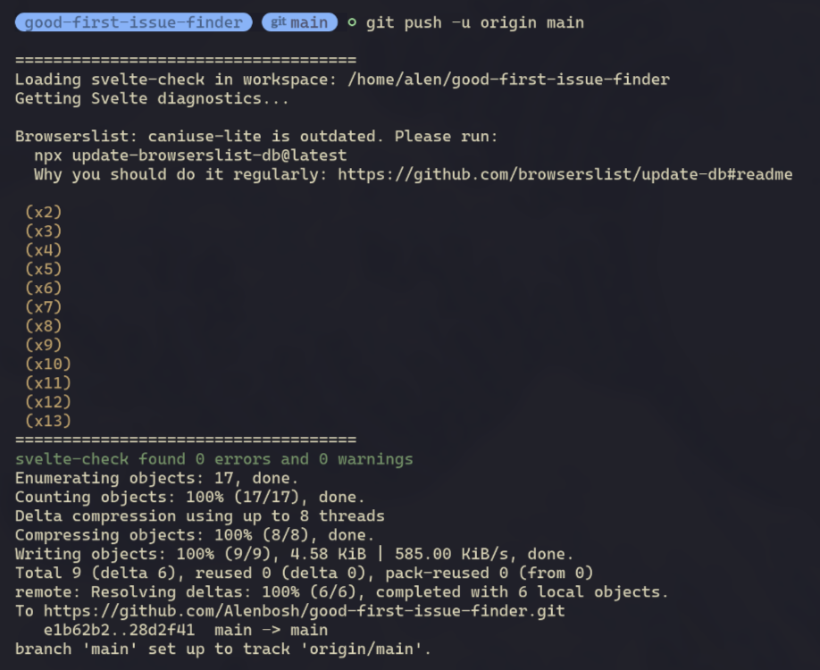

## Jan 23:
-- Wasted my damn day learning about all api related to Baseball.

-- Also wasted half my day patching and unpatching. Also did making && removing of packaging.

--learned about OAuth App which acts as a tools which redirects user to github.

--Husky creates/installs hooks and makes git use them at certain moments like git commit and git push, it just initializes certain hooks to work at runtime. For example if i have EsLint, Prettier or svlete-checks, it can initiates check for code beng pushed.

To be clear, Husky just alerts programs/triggers the real tools like svlete, EsLint, etc. Real work is done by the hooks themselves

-- Hopefully i would've done 5-6 days of java related work.
